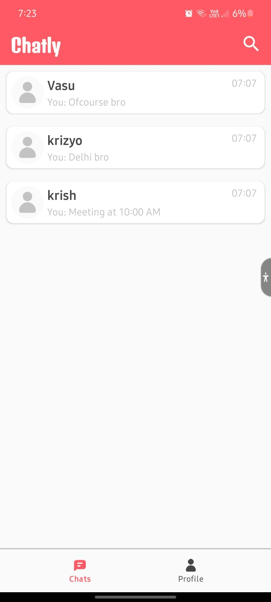
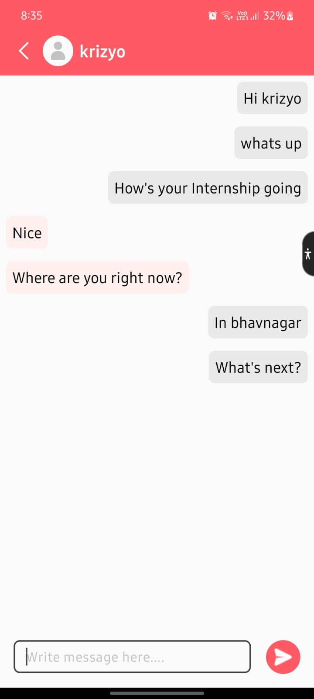
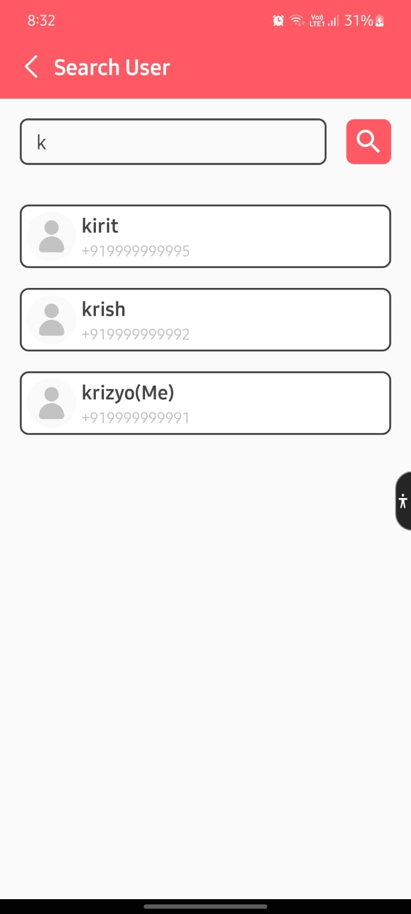

# Chatly
Developed an Android chat application focused on enabling easy and real-time communication between users, featuring secure login and cloud-based chat storage.

Developed in Java, integrated Firebase Authentication for user login, Firebase Cloud Firestore for chat storage, and used OkHttp for API communication.

## Mockups

  
  
  

## User Credentials
MobileNumber: 99999 99991 &emsp; VerificationCode: 111111 
MobileNumber: 99999 99992 &emsp; VerificationCode: 222222 
MobileNumber: 99999 99993 &emsp; VerificationCode: 333333 
MobileNumber: 99999 99994 &emsp; VerificationCode: 444444 
MobileNumber: 99999 99995 &emsp; VerificationCode: 555555 
MobileNumber: 99999 99996 &emsp; VerificationCode: 666666 
MobileNumber: 99999 99997 &emsp; VerificationCode: 777777 
MobileNumber: 99999 99998 &emsp; VerificationCode: 888888 
MobileNumber: 99999 99999 &emsp; VerificationCode: 999999 
MobileNumber: 99999 99910 &emsp; VerificationCode: 101010
